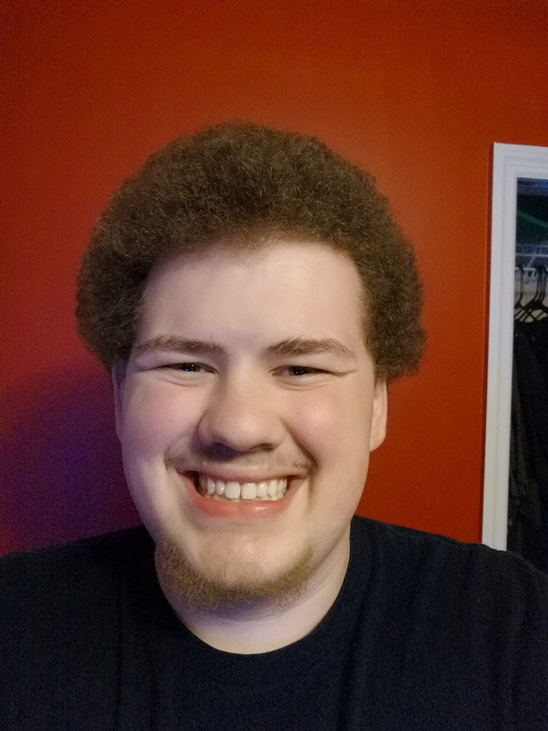

* [Home](../index.md)
* **About**
* [Lectures](Lectures.md)
* [Write Ups](Write_Ups.md)
* [Downloads](Downloads.md)
* [Programming Tutorials](Programming_Tutorials.md)
* [Robot Resources](Robot_Resources.md)
* [Contact](Contact.md)

* * *
## What is this workshop?
The Programming Workshop is ran by ASME and taught by Brandon Silva. It's purpose is to spark interest and teach programming to those who are new or inexperienced using the Arduino microcontroller and C++.  
Every week, new programming concepts and methods are introduced and build off the last lectures, followed by an Arduino project applying the concepts learned.  
The workshops are meant to be fun, interesting, and engaging. If you haven't already, come check it out! You won't reject it!

## What do I need for the workshop?
There are only four things you need to get the most out of this workshop:
- Your brain.
- A notebook and pencil to take notes.
- A laptop.
- The Arduino Super Starter kit. Kits will be provided in class. However I highly suggest buying one for yourself so you can do your own projects! [Here](https://www.amazon.com/SainSmart-Starter-Learning-Tutorial-Arduino-Basic/dp/B074DWG8B9?crid=2M2MP1AIXNB2I&keywords) is the link to the kit we will be using, its only 20 dollars.

## Who is Brandon Silva?
Well I am glad you asked! My name is Brandon Silva and I am in my second year here at UCF majoring in Computer Engineering.  
I have been programming for a little over five years now, ever since the beginning of high school. I got involved in programming through my school's FIRST robotics club, [The Nerds of Prey](http://thenerdsofprey.com). You may of heard about [FIRST](https://www.firstinspires.org/robotics/frc) as they have one of their competitions in the CFE Arena every year in March.  
I am mostly self taught, having learned C, C++, Java, and Python. I love to teach and help improve other people's skills!  
Here is a picture of me:  

